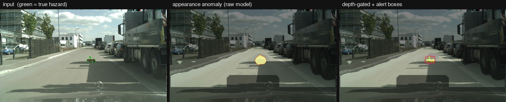
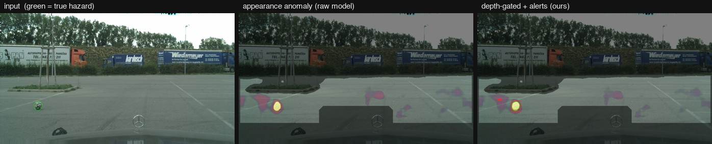

<div align="center">

# Road-Hazard Corner-Case Detection

Flagging unknown obstacles on the road — the debris, lost cargo, and animals a self-driving car's perception was never trained to recognize.



*Input with the true hazard in green · raw anomaly heat on the road · after the depth gate, with the alert box.*

</div>

## About

Self-driving perception models are trained on a fixed set of classes — car, person, road, sign. Anything outside that set gets confidently mislabeled instead of flagged, which is a problem when the thing outside the set is a tire in your lane or a pothole left open.

This is an anomaly detector for that gap. A segmentation network is trained to become *unconfident* on unfamiliar objects, so wherever it's unsure on the road, that's a likely hazard. A depth-based filter then removes false alarms from flat road markings and manhole covers. The whole model was trained from scratch, no cloud, no pretrained anomaly checkpoint.

**Built with:** PyTorch (MPS) · DeepLabV3-ResNet50 · Cityscapes · Lost & Found · RoadAnomaly21

## Results

Lost & Found, road-region protocol, scene-level held-out split:

| Method | AUPR | AUROC | FPR@95 |
|---|---|---|---|
| Trained model | 0.69 | 0.96 | 0.22 |
| **+ depth gate** | **0.89** | **0.98** | **0.11** |
| Swin-B checkpoint *(reference)* | 0.78 | — | 0.29 |
| RbA paper *(reference)* | 0.70 | — | 0.06 |

The trained model matches the published paper's average precision (0.69 vs 0.70), and the depth gate takes it past the pretrained Swin-B checkpoint on both AUPR and false-positive rate.

Second benchmark, RoadAnomaly21: AUPR 0.37 — weaker, because the model is specialized to road-scene hazards rather than general anomalies. More on that below.

## How it works

1. Train a DeepLabV3-ResNet50 on Cityscapes, with unknown objects pasted into scenes so it learns to be unconfident on unfamiliar things (*outlier exposure*).
2. Score each pixel by how strongly the model rejects every known class.
3. Restrict to the predicted drivable road, minus the ego vehicle.
4. **Depth gate** — fit the road's 3D plane and suppress anomalies that lie flat in it (paint, manholes) while keeping objects that stick up.
5. Box the surviving alerts.



*Road markings and a manhole firing (middle) get knocked down by the depth gate (right), while the real hazard survives.*

## Limitations

- Trained on paved Cityscapes roads, so it over fires on out-of-domain surfaces like gravel.
- False-positive rate sits above the paper's, theirs uses a larger backbone and far more outlier data.
- Depth is currently monocular; Lost & Found ships real stereo disparity as a drop in upgrade.
- 30 frame test set, so treat small differences as noise.

## Getting started

```bash
pip install -r requirements.txt
# Cityscapes goes in data/cityscapes, Lost & Found in data/lost_and_found
```

## Usage

```bash
# train the segmenter 
PYTORCH_ENABLE_MPS_FALLBACK=1 python scripts/train_ood_segmenter.py --epochs 25

# evaluate on Lost & Found, and the depth-gated version
python scripts/evaluate_trained_ood.py
PYTORCH_ENABLE_MPS_FALLBACK=1 python scripts/evaluate_depth_gated.py --mode trained --depth mono

# generate the demo strips 
PYTORCH_ENABLE_MPS_FALLBACK=1 python scripts/demo_trained_pipeline.py --n 30
```

## Contact

Jayant Rathi — jayant12rathi@gmail.com

