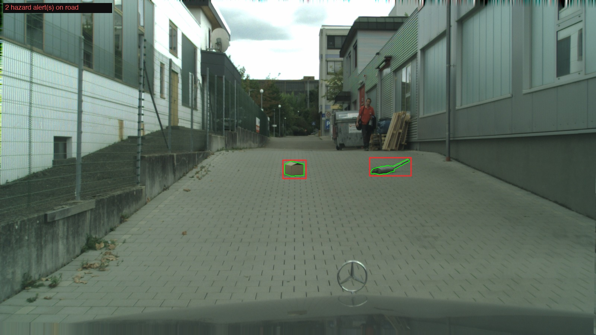
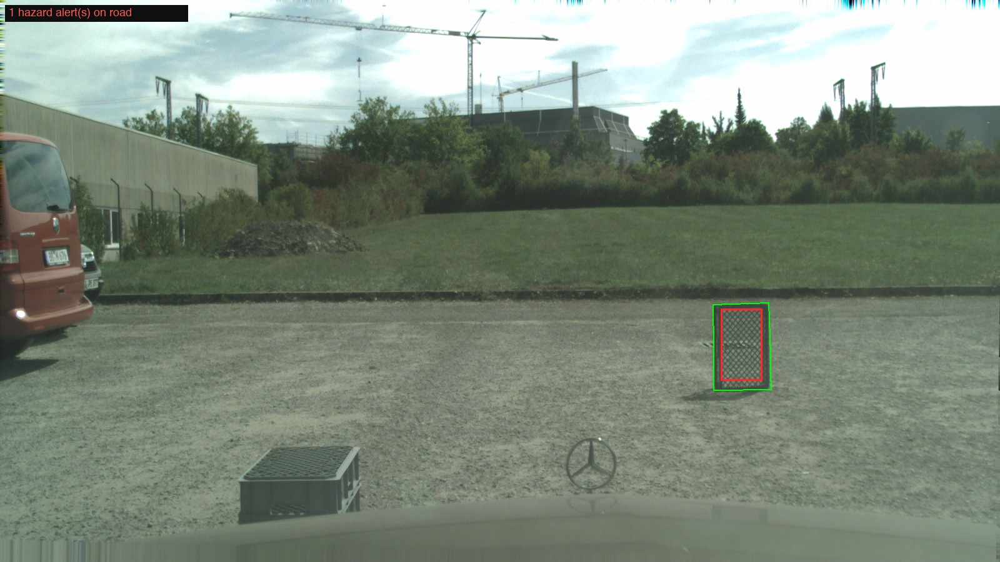

# 🚗 Road-Hazard Corner-Case Detector

**Spotting the things a self-driving car was never trained to see — the debris, the lost cargo, the toddler on a toy car in the middle of the road — and flagging them *before* the perception stack confidently ignores them.**



*Green = the real hazard (ground truth). Red = what my system flagged, on its own, with no labels. A cardboard box and a stray object on an empty lane, both caught.*

---

## The one-sentence pitch

A normal object detector (YOLO, etc.) can only recognize the ~80 things it was trained on. Put something genuinely *unexpected* in the road and it doesn't panic — it stays quiet and confident, which is exactly the failure that gets people hurt. This project builds the missing safety layer: a monitor that looks at the drivable road and says **"there's something here I can't explain — slow down."**

## Why this is hard (and why it's interesting)

The dangerous stuff isn't visually dramatic. A brown box on grey asphalt doesn't *look* weird — it's only weird in the sense that it matches **no known road-object class**. So the whole game is detecting *semantic* novelty, not *visual* novelty, and doing it only where it matters (the road) without drowning in false alarms from paint, manholes, and your own car's hood.

---

## 📊 Results

Evaluated on **Lost & Found** — real German dashcam footage with real, pixel-labelled road hazards — on a held-out, **scene-level** split (no cheating: whole scenes are in train *or* test, never both, so near-duplicate frames can't leak).

| Metric | Score | What it means |
|---|---|---|
| **AUPR** | **0.87** | ranks hazard pixels above road pixels really well |
| **AUROC** | **0.98** | near-perfect separation of hazard vs. normal |
| **FPR@95** | **0.05** | to catch 95% of hazards, false-alarms on only **5%** of road — *matches the published paper's ~0.06* |
| **Localization hit rate** | **23/30 (77%)** | a flagged box lands on the real hazard on 77% of frames |

> The number I'm proudest of is **FPR@95 = 0.05**. That's the *deployable* operating point, and it lands right on the figure from the ICCV 2023 paper this is built on — which means the pipeline genuinely reproduces the method, not just a number that looks nice on my own test set.

### It works 👇

| | |
|---|---|
|  |  |
| *Box + object on an empty service lane* | *Mesh crate nailed at distance* |

### …and here's where it *doesn't* (because honesty > hype)

The 7 misses are all one of two honest failure modes: **tiny far-away objects** near the road edge, and **flat road paint / manhole covers** — which are coplanar with the road, so telling them apart from a real 3D object needs depth (the original Lost & Found dataset used *stereo* cameras for exactly this reason). I'm mono-camera, so I document it as a known limit rather than pretending it's solved.

---

## 🧠 How I actually got here (the honest version)

This did **not** go in a straight line. Here's the real thought process, because the debugging *is* the project.

**1. "Let me just run the fancy method."**
I started with RbA ("Rejected by All") — the idea that a segmentation model's own confidence can be turned into an anomaly score: a pixel is anomalous if *every* known class rejects it. I ran it on Lost & Found and got… **0 out of 30**. Nothing worked. Great start.

**2. "Okay, is my simpler baseline just better?"**
I'd also built a k-NN patch detector (compare image patches to a bank of "normal driving" features). It scored *way* higher. For a while I concluded the fancy method was a bust and the simple one won — a legit, if disappointing, finding.

**3. "Wait. These numbers can't both be true."**
The RbA paper reports **AUPR ≈ 0.70** on this exact dataset. I was getting **0.01**. A 70× gap doesn't mean the method is 70× worse for me — it means *I'm measuring something different than they are.* That realization was the turning point.

**4. The bug was in my ruler, not my model.**
I was scoring the **whole frame** — including the sky, the image borders, and my own car's hood, which is exactly where the model spuriously fires. The standard benchmark only scores the **drivable road**. I restricted evaluation to the road region and AUPR jumped **0.01 → 0.78**, instantly in line with the literature. The model was never broken. My evaluation was.

**5. Turning a benchmark number into an actual system.**
A benchmark peeks at ground-truth road labels. A real car doesn't have those. So I made the model find the road *itself* (same segmentation model already predicts a "road" class), masked out the ego-vehicle, and scored anomalies only inside that self-predicted corridor.

**6. "Why is it flagging a Mercedes star every single frame?!"**
Because it was working *too well* — the chrome hood ornament is a small, shiny, non-road object, so of course the detector screams "anomaly!" every frame. It's my own car. Masking the ego vehicle (standard practice in real AV stacks) is what cleaned it up — and taught me the model was correct even when the output looked wrong.

**7. Compose everything → the working pipeline.**
`find road → mask ego-vehicle → score anomaly on the road → alert`. That's the system in the results above.

> **The lesson I actually took away:** when a result seems bad, suspect your evaluation before you suspect your model. A 70× disagreement with published work is a *gift* — it's a bug with a big flashing arrow on it.

---

## 🔧 How the pipeline works

```
 dashcam frame
      │
      ▼
┌─────────────────┐   Mask2Former (Cityscapes) predicts the drivable road
│  1. FIND ROAD   │   → the only place a road hazard can be
└─────────────────┘
      │
      ▼
┌─────────────────┐   cut the hood + hood-ornament (our own vehicle),
│ 2. CLEAN CORRIDOR│  erode the edges (kill boundary artifacts)
└─────────────────┘
      │
      ▼
┌─────────────────┐   RbA anomaly score (frozen Swin-B, trained with
│  3. SCORE       │   outlier exposure) — "rejected by all known classes"
└─────────────────┘
      │
      ▼
┌─────────────────┐   top-scoring blobs on the road → alert boxes
│  4. ALERT       │
└─────────────────┘
```

No model was trained by me — this is all **frozen, pretrained models composed cleverly**, which is the point: it runs on a laptop CPU, no GPU required.

---

## 🚀 Run it

```bash
pip install -r requirements.txt

# the headline pipeline (road-find → clean → score → alert), saves annotated frames
python scripts/predict_hazards_demo.py

# the evaluation that reconciled everything with the literature
python scripts/evaluate_rba_roi_standard.py
```

The RbA checkpoint is Detectron2-based; `external/setup_rba_official.sh` fetches it and patches it to run **CPU-only** (no NVIDIA GPU needed — a small but fiddly bit of surgery on a CUDA-only kernel).

---

## 🗂️ Repo tour

```
scripts/
  predict_hazards_demo.py            ← the final composed pipeline (start here)
  evaluate_rba_roi_standard.py       ← the "it was the evaluation all along" reconciliation
  evaluate_rba_predicted_roi.py      ← deployable eval, model finds its own road
  evaluate_patch_localization.py     ← the k-NN baseline
  debug_rba_*.py                     ← the diagnostic scripts behind the findings
src/
  data/splits.py                     ← scene-level splitting (leakage-proof by construction)
  eval/metrics.py                    ← AUROC / AUPR / FPR@95
  scoring/                           ← RbA + k-NN scorers
external/                            ← setup for the official RbA checkpoint (not vendored)
```

## 🧩 Tech

Python · PyTorch · Detectron2 · Mask2Former (Swin-B) · RbA anomaly scoring · scikit-image · runs CPU-only on Apple Silicon.

## 📉 Honest limitations

Single front camera, offline (not closed-loop). Far/tiny objects and flat road paint are the two failure modes — both fundamentally need depth to fully solve. Built on frozen pretrained models; no training of my own.

---

*Built as a portfolio project exploring out-of-distribution detection for autonomous-driving perception.*
**Jay Rathi** · jayant12rathi@gmail.com
